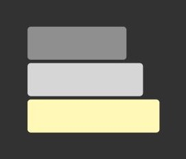

#  WODit

Designer & Developer: IRAH ROSETE

url: https://wodit.netlify.app/ 
api: https://wodit-app.herokuapp.com/ 
Git Repo: https://github.com/irahrosete/wodit

## About

In June 2021, I participated in the Push Up Challenge and did 3,318 push ups in 25 days. The habit stuck with me and three months on, I am still doing daily push ups.

This app is inspired by the Push Up Challenge.

## Features

- Single activity
- WOD (Workout of the Day)
- 'The Girls'
- User Authentication
- Admin Dashboard

## Target Audience

## User Stories

## Sitemap

## Planning

Trello Board: https://trello.com/b/Tef96hTL/wodit

## Tech Stack

- MongoDB
- Express JS
- React
- Node JS

### Tools

- Yarn
- NPM
- Netlify
- Heroku
- Trello
- Figma
- Hero Icons

### Dependencies

- Tailwind CSS
- React Date Picker
- React Dial Knob
- React Router DOM
- Axios
- Nodemon
- Mongoose
- Dotenv
- CORS

## Wireframes

## Testing

## Deployment

## Local Setup
